## Building Resilience into Go Services

By Max Collier

---

# Topics for today


A recounting of production service failures 😱
Consider error handling and vulnerable in service design
Open source solution to address concerns

---

## Today's Service 
 *Alert Sender...*

---

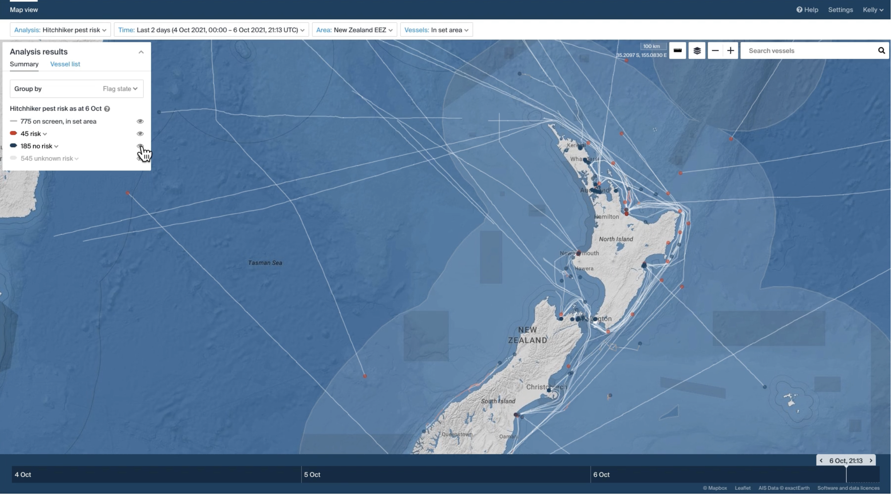

---

### Example: *Vessel has entered area*

Vessel <Endeavour> Has entered Area <New Zealand 400mn> At <01/.01/.2025 00:00 NZST>

---

### Example: *Vessel has exited area*

Vessel <Endeavour> Has exited Area <New Zealand 400mn> At <02/.01/.2025 00:00 NZST>

---

### Example: *Vessel missing AIS in area*

Vessel <Endeavour> has stopped reporting AIS within Area <New Zealand 400mn> From <02/.01/.2025 00:00 NZST> for over <X duration>

---

## Architecture

How do we represent this in a system? 


---

### Alerting Framework

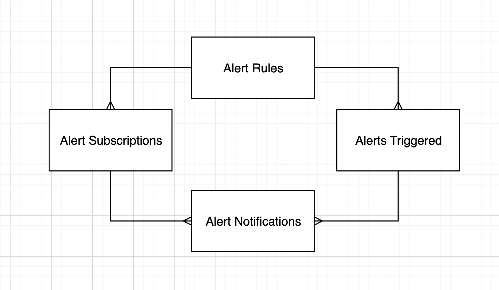

---

### What do I need?

* Alert Rules
* Vessel Identities
* Users with timezones
* Vessel Events (Activity)
* Additional Vessel Information

---


### Alerting Framework

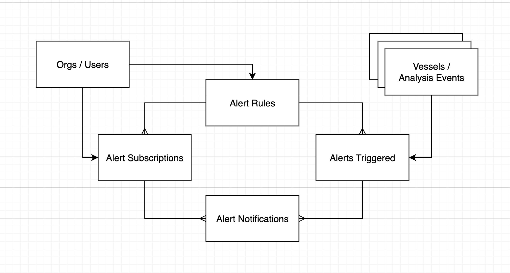

---

### Alert Sender

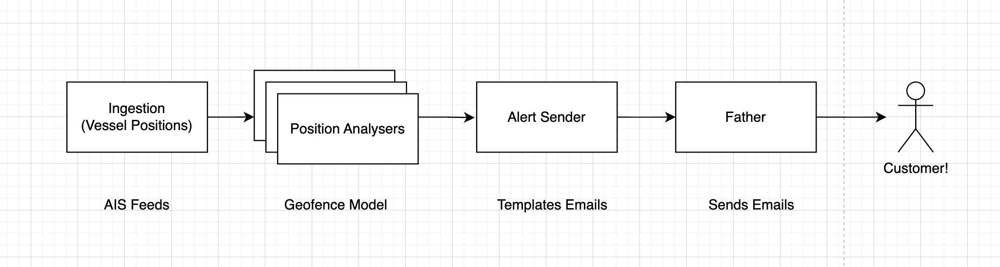


---

### Alert Sender

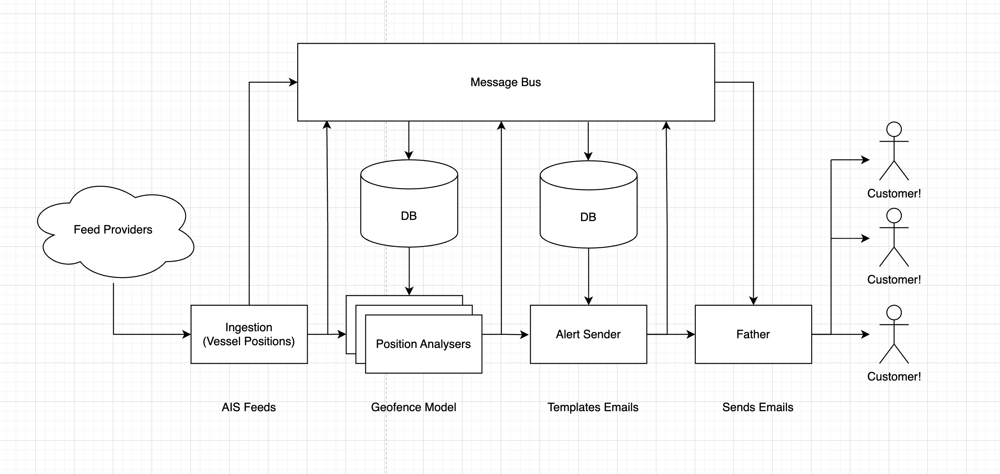

---


### Alert sender complexity

---


---

### Architecture constraints

* Long running processes: one deployment per alert-types (i.e digest, or realtime) 
* Core process loop: handles all alert-notifications across organisations / users.
* Alerts Framework: requires notifications to be queued to send before marking as complete.

---

### So, in other words

Alert sender has no redundancy

...


---

## Game Time!

---

## Sherlock...


---


---

# Ready?

---


---


---


---

## First Outage

#### *No error handling*

---


## What went wrong?

---

### Alert Sender

```Go
func (s *service) processAlerts(notifications []*starboard.Notifications) {
    // ...

    users, err := starboard.UsersFromIDs(ctx, userIDs)
    If err != nil {
        // TODO: log error
        return
    }

    vessels, err := starboard.VesselsFromVesselIDs(ctx, vesselIDs)
    If err != nil {
        // TODO: log error
        return
    }

    // ...
}
```

--- 


### Alert Sender

```Go
func (s *service) ProcessAlerts(notifications []*starboard.Notifications) error {
    // ...

    users, err := starboard.UsersFromIDs(ctx, userIDs)
    If err != nil {
        log.Error(err).Msg("query_failed_user_profiles")

        return err
    }

    vessels, err := starboard.VesselsFromVesselIDs(ctx, vesselIDs)
    If err != nil {
        log.Error(err).Msg("query_failed_vessel_profiles")

        return err
    }

    // ...
}
```

--- 


### Consequences

* Customers let us know they weren’t receiving emails
* Errors had been occurring in our system but we had no visibility into when or where they were occurring

---

### Postmortem 

* Log errors :faceplam:
* Fix issue that caused the problem
* Apologies to customers, explain, fix, move on.


---

## Next Up


---

## Second Outage

#### *Panic occurances*

---

## Considerations

* Panics are not protected around go routine boundaries
* Long running service requires it's own panic handling
* HTTP / gRPC services provide default panic handlers
* Panic handling can be considered an afterthough from initial service design

---

### Alert Sender V1

```Go
func (s *service) run() {

    // setup ...

    for {
        select {
        case <-shutdown:
            os.Exit(0)
        case <-s.ticker.C:

            notifications, err := s.PendingAlerts(ctx)
            if err != nil {
                // TODO: logging
                continue
            }

            if len(notifications) > 0 {
                go s.ProcessAlerts(notifications)
            } 
        }
    }
}
```

---


### With Recovery

```Go
func (s *service) run() {

    // setup ...

    for {
        select {
        case <-shutdown:
            os.Exit(0)
        case <-s.ticker.C:

            notifications, err := s.PendingAlerts(ctx)
            if err != nil {
                log.Error(err).Msg("failed_query_pending_alerts")
                continue
            }

            // refactor ...
            go func() {
                err := s.ProcessAlerts(notifications)
                if err != nil {
                    log.Error(err).Msg("failed_process_alerts_invoke")
                    continue
                }
                log.Error(err).Msg("successful_process_alerts_invoke")
            }()
        }
    }
}
```


---


### With Recovery

```Go
// refactor ...
go func() {
    defer () {
        if r := recover(); r != nil {
            log.WithField("panic", r).Msg("panic_occured_process_alerts_invoke")
        }
    }()

    err := s.ProcessAlerts(notifications)
    if err != nil {
        log.Error(err).Msg("failed_process_alerts_invoke")

        continue
    }

    log.Error(err).Msg("successful_process_alerts_invoke")
}()
```

---


*What is the language's philosophy of Go's panic behaviour?*

---


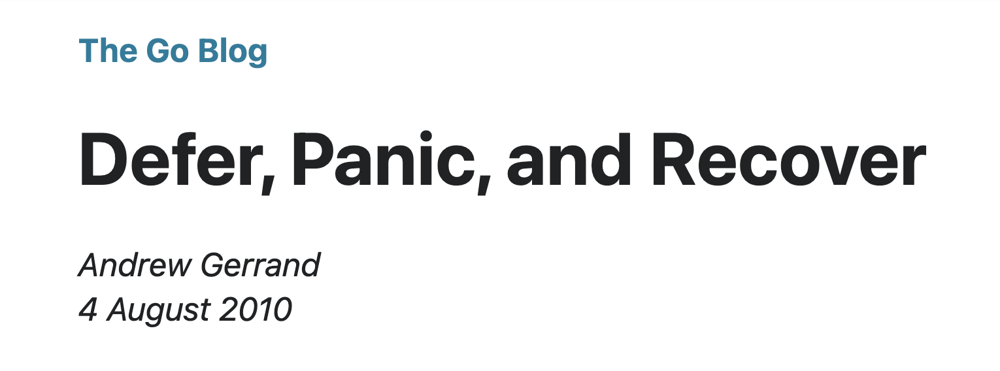

---

#### Go Philosophy on Panic Handling

* Errors are normal; panics are exceptional.

* Go encourages explicit error handling of `error`s.

* Panics should be reserved for unexpected, or unrecoverable situations.

* Panics are not for flow control.

---

#### Types of panic occurrences

Divide by zero
Invalid type assertion
Concurrent map writes
Nil pointer dereference
Array or slice index out of range
Explicit Intent

---

***Considerations with Go Routines?***


---

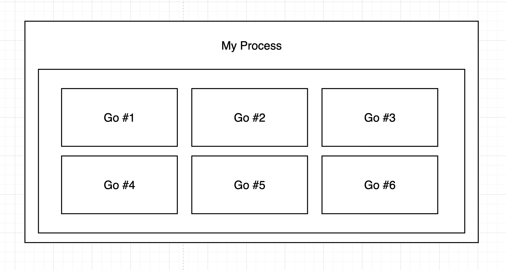

---

### Http handlers

```Go
http.HandleFunc("/", func(w http.ResponseWriter, r *http.Request) {
    panic("oops") // Won't crash the server
})
```

---

### In our case

*An unused fields is suddenly used*

... 


---

1) UserDB: user.isDeleted = TRUE
2) user has active alert rules/subscriptions
3) alert sender cannot query user
4) Lookup on user causes nil pointer dereference

---

### Consequences

* Customers let us know they weren’t receiving emails
* Panics brought down system for all users when emails wouldn't send for a particular user

---

### Postmortem 

* Fixed bug for deleted users
* Introduce panic recovery for handler
* Apologies to customers, explain, fix, move on.

---

## Next Up


---

## Third Outage

#### *No alerts set for application errors*

---


---

## Story Time

---


---

### Service Diagram


---


### Consequences

* Customers let us know they weren’t receiving emails
* Errors in templating alerts should fail independently
* Slack alerts for service error logs and OOM events


---

### Postmortem 

* Fixed bug with templating alerts
* Deleted pending notifications in prod older than 48hrs
* Apologies to customers, explain, fix, move on

---

## Open Source

---

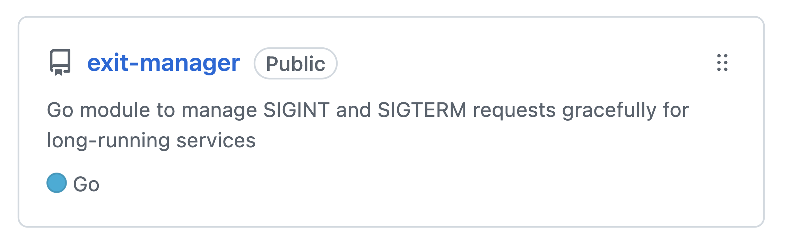

---


---

```Go
package main

import (
    "log"
    "time"

    exitmanager "github.com/mcwalrus/exit-manager"
)

func main() {
    em := exitmanager.Global()

    // Start workers
    for i := 0; i < 3; i++ {
        go criticalWorker(em, i)
    }

    // Wait for shutdown signal
    <-em.Notify()
    
    // Avoid exit on main routine
    select {}
}
```

---

```Go
func criticalWorker(em *exitmanager.ExitManager, id int) {
    for {
        // Acquire lock to prevent shutdown
        if err := em.AcquireShutdownLock(); err != nil {
            return
        }

        // Simulate work
        time.Sleep(3 * time.Second)
        em.ReleaseShutdownLock()

        // Check for shutdown signal
        select {
        case <-em.Notify():
            return
        case <-time.After(1 * time.Second):
        }
    }
}
```

---

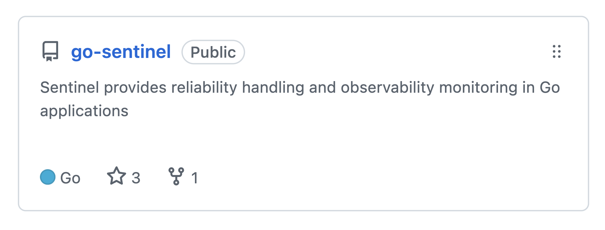

---

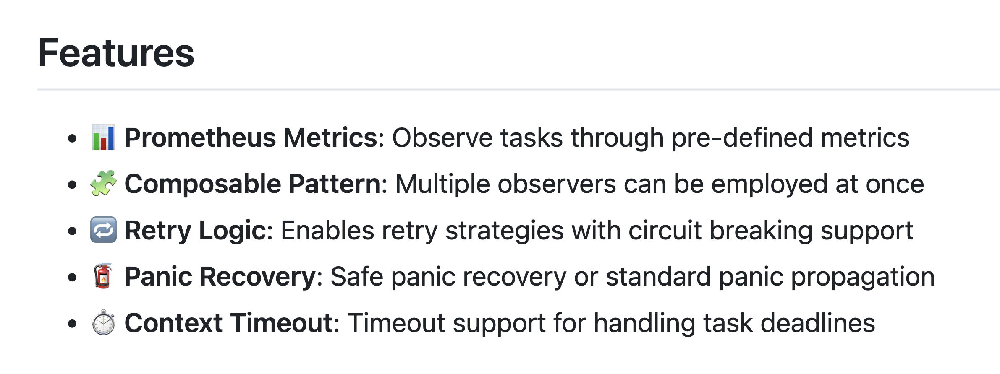

---

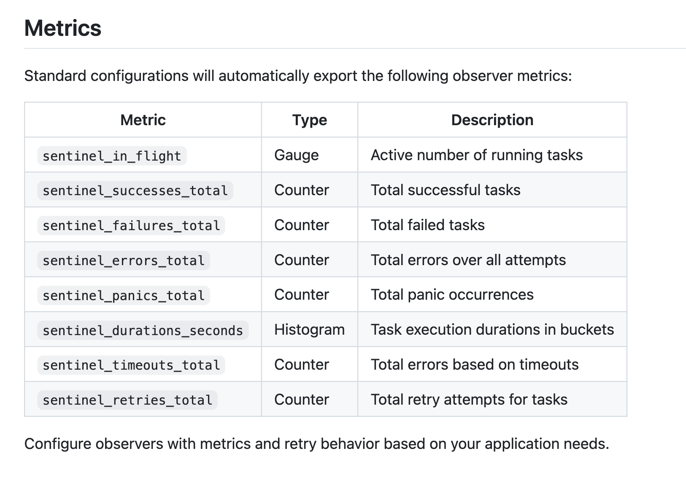

---

## Sentinel's Philosphy

* Treat panics as an errors

* Metrics can paint a picture of services

* Proactively recover `panics` for failiures in services

---

https://github.com/mcwalrus/go-sentinel

---

## To Recap

* Handle errors
* Consider panic handlers
* Alert on service errors / failure events

---


---

*Thanks for listening*

---